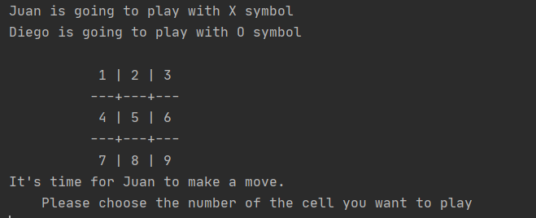

# tic-tac-toe

> This is a solution to the [Odin project lesson: Tic Tac Toe](https://www.theodinproject.com/courses/ruby-programming/lessons/tic-tac-toe). 

This is a microverse approach to develop a Tic Tac Toe game in ruby.

## Built With

- Ruby

## Getting Started 

- Run this command in your OS terminal: `git clone https://github.com/JuanDavid31/tic-tac-toe.git` to get a copy of the project.
- Open a terminal in the project folder and run `ruby bin/main.rb`.

### Prerequisites

* Internet connection
* Having Ruby installed on you OS

### Usage

* Execute the `app.rb` file

### Game description

What is Tic Tac Toe? It is a game that consists of two players and a 3x3 cell board, a symbol is assigned 
to each player; it can be 'X' or 'O', the symbol should be different for each player. The players will take
turns to mark an empty cell, the first player to strike a three symbol straight line wins, 
the line can be horizontal, vertical, or diagonal. If the board is full and there is no winner, then there is
a tie.

### Game instructions

- To start the game, refer to **Getting Started** section.
- Write your name and press enter
- Write your symbol of choice and press enter
- Write the name of the second player and press enter (The symbol will be the remaining one)
- Check who's player's turn and write the number of the cell you want to mark
- Repeat the last step until there is a winner or a tie
- If you want to play again write 'Y' otherwise write 'N' to finish the game. 

## Authors

👤 **Author1**

- GitHub: [JuanDavid31](https://github.com/JuanDavid31)
- Twitter: [Juan David Piza](https://twitter.com/jdpw31)

👤 **Author2**

- GitHub: [disc3110](https://github.com/disc3110)
- Twitter: [Diego Ivan Solis](https://twitter.com/disc3110)

## 🤝 Contributing

Contributions, issues, and feature requests are welcome!

Feel free to check the [issues page](https://github.com/JuanDavid31/tic-tac-toe/issues).

## Show your support

Give a ⭐️ if you like this project!

## Acknowledgments

- To developers, Microverse, ruby official guidelines and The odin Project

## 📝 License

This project is [MIT](https://es.wikipedia.org/wiki/Licencia_MIT) licensed.
